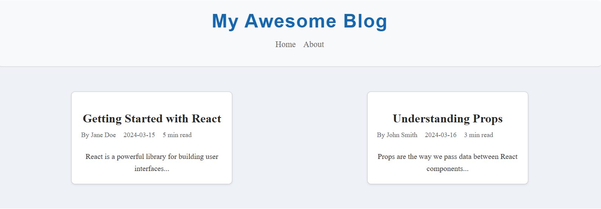

# react-blog

# My React Blog

A blog platform built with React and Vite.

## Setup Instructions
1. Clone the repository
2. Run `npm install`
3. Run `npm run dev`
4. Open http://localhost:5173 in your browser

## Project Structure
> `src/`: Contains all the source code for the React components, styles, and assets.
> `components`: Contains reusable React components.
> `App.jsx`: The main app component that renders the content.
> `index.js`: The entry point for the React Application.

## Screenshot

## What I Learned
> Understanding React component structure and lifecycle.
> Using Vite for faster development and hot module replacement.
> Styling React components with CSS for responsive design.

<!-- Assignment-1 -->

## Styling Approach
I used simple CSS to make the blog look nice and clear. The blog list has a light background, and each blog post has rounded corners and a shadow for depth. When you hover over a post, it slightly grows and shows a bigger shadow. The design adjusts to fit smaller screens.

## New Features
BlogList.css is added 

## Screenshots

